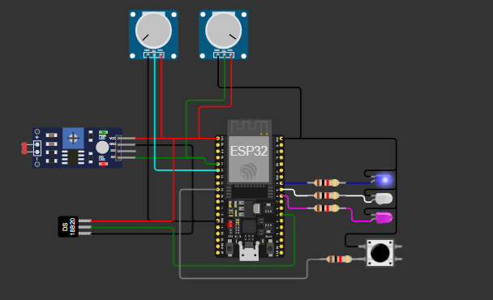
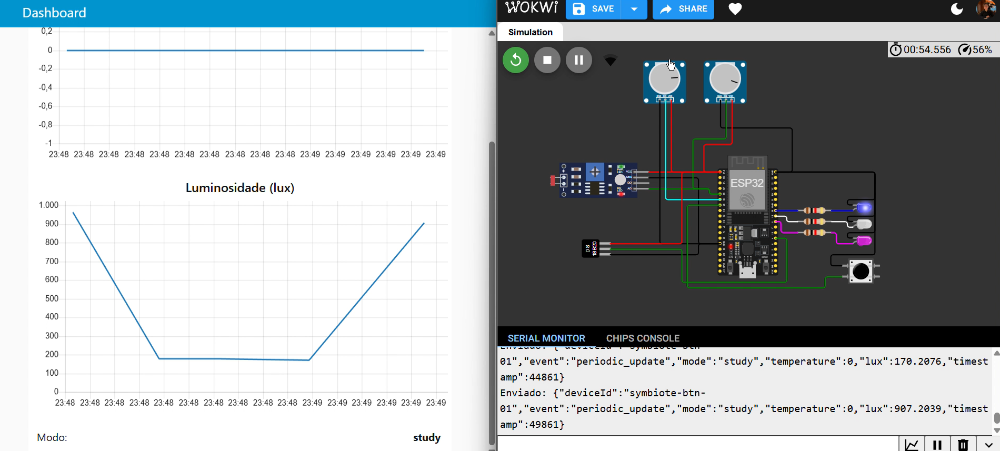
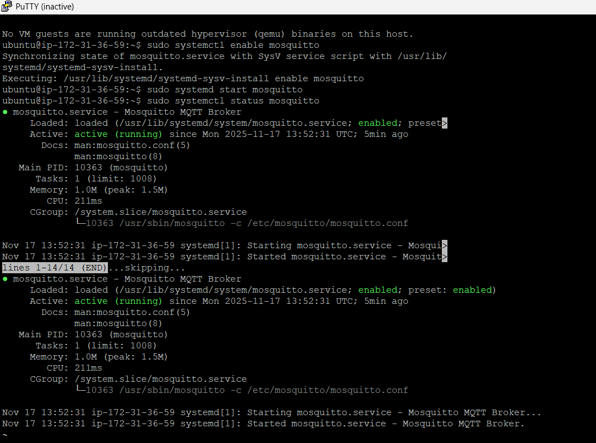
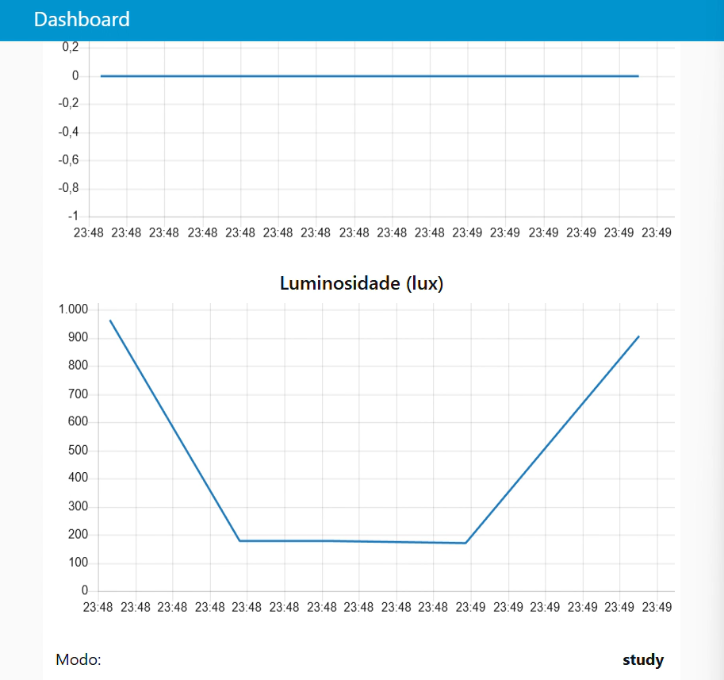
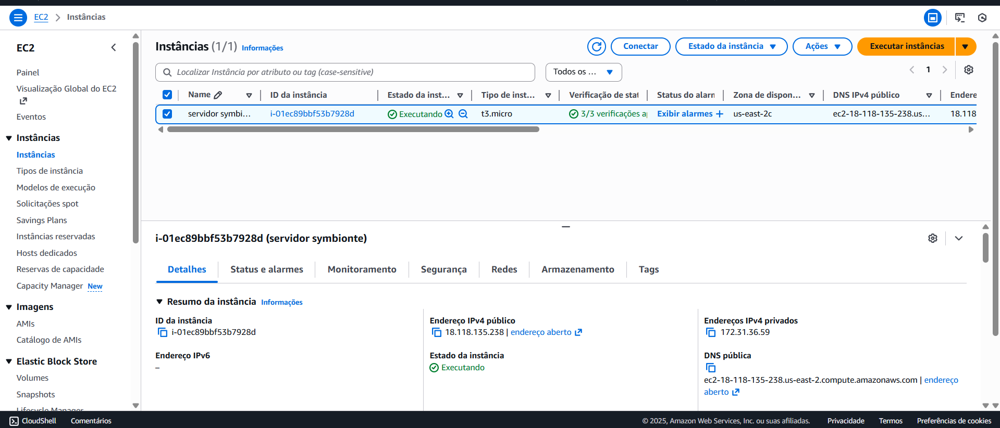
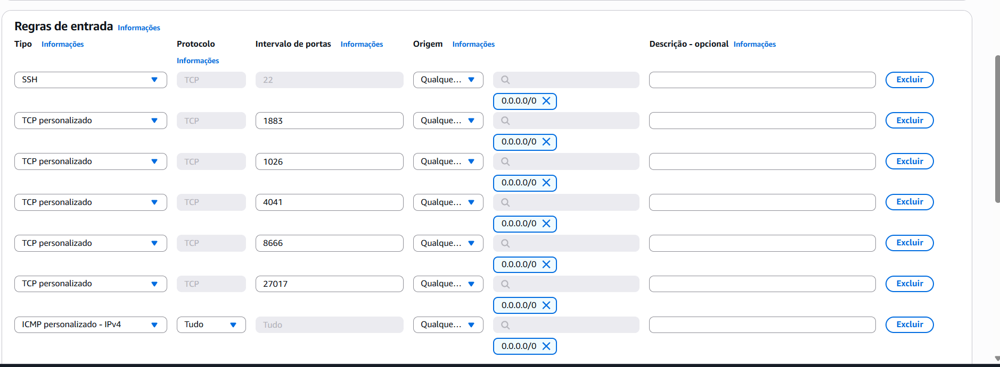
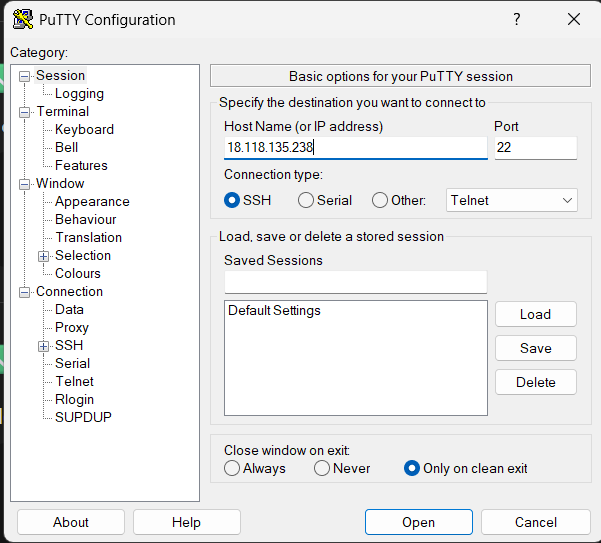

# **SYMβIOTE — IoT para o Futuro do Trabalho**

### Global Solution 2025 — FIAP

---

## **Integrantes**

* Vinicius Mafra Paiva — RM565916
* Kaike Correia de Sousa — RM561623
* Nduarda de Castro Coutinho dos Santos — RM562184

---

# 1. **Descrição do Problema**

O futuro do trabalho exige profissionais capazes de aprender rapidamente, manter foco em ambientes híbridos e adaptar-se às mudanças constantes.
Entretanto, muitos usuários enfrentam dificuldades como:

* Ambientes inadequados (calor, baixa luminosidade, distrações)
* Falta de indicadores sobre produtividade
* Baixa integração entre ferramentas físicas e digitais
* Dificuldade em monitorar sua própria evolução

Tais fatores prejudicam aprendizado, saúde e eficiência no trabalho.

---

# 2. **A Solução – SYMβIOTE IoT**

O SYMβIOTE é uma plataforma inteligente para desenvolvimento contínuo de habilidades.
Neste projeto, desenvolvemos um dispositivo físico que conecta o ambiente real ao contexto digital:

# **Symbiote Context Button — Dispositivo IoT com ESP32**

Ele atua em três frentes principais.

---

## 2.1 Monitoramento Ambiental

O dispositivo mede em tempo real:

* Temperatura (DS18B20)
* Luminosidade (LDR)

Isso permite avaliar as condições do ambiente e melhorar foco e bem-estar.


---

## 2.2 Detecção de Modo de Contexto

O botão físico alterna entre três modos de uso:

* **Study**
* **Work**
* **Pause**

Com LEDs indicativos para cada modo:

* Azul: Study
* Verde: Work
* Vermelho: Pause


---

## 2.3 Envio de Dados via MQTT

O ESP32 envia mensagens automaticamente:

* A cada **5 segundos**
* Sempre que o botão muda o modo

O envio acontece no formato JSON.


---

# 3. **Arquitetura do Sistema**

Fluxo geral da solução:

```
[ ESP32 ]
     ↓ (MQTT Publish)
[ Broker MQTT - HiveMQ / Mosquitto ]
     ↓
[ Node-RED ] → Dashboard + Regras + Integração Symbiote
```

---

# 4. **Comunicação MQTT — Parte Técnica**

### Tópico utilizado

```
symbiote/context
```

### Exemplo de JSON enviado

```json
{
  "deviceId": "symbiote-btn-01",
  "event": "periodic_update",
  "mode": "study",
  "temperature": 24.8,
  "lux": 310.2,
  "timestamp": 1731888861
}
```

### Tipos de eventos

| Evento          | Descrição                                 |
| --------------- | ----------------------------------------- |
| periodic_update | Enviado automaticamente a cada 5 segundos |
| context_change  | Enviado quando o botão muda o modo        |

### Broker utilizado

* Endereço: **broker.hivemq.com**
* Porta: **1883**

---

# 5. **Reprodução Local do Projeto**

## Requisitos

* Node.js e Node-RED
* Broker MQTT (HiveMQ, Mosquitto, AWS EC2 etc.)
* Arduino IDE
* Wokwi ou ESP32 físico

---

## 5.1 Configuração da AWS 

**Criação da instância:**


**Regras de segurança configuradas:**

---

## 5.2 Conexão via SSH (Putty)


---

# 6. **Simulação Wokwi**

Simulação completa disponível:
**[link-wokwi](https://wokwi.com/projects/447869522108655617)**

### Passos:

1. Abrir o link do projeto
2. Clicar em Start Simulation
3. Abrir o Serial Monitor
4. Verificar leituras de sensores
5. Conferir envio MQTT no Node-RED

---

# 7. **Node-RED – Fluxo e Dashboard**

O Node-RED exibe:

* Temperatura
* Luminosidade
* Modo atual
* Eventos recebidos
* JSONs publicados

E inclui lógica para alertas e recomendações.

**Imagem do Dashboard / Fluxo:**


---

# 8. **Código-Fonte**

O repositório inclui:

* Código ESP32: 

Mas atenção:  
No Markdown real, você precisa **colocar três crases** antes e depois do código.  
Aqui no chat, se eu colocar direto, vai quebrar — então abaixo está **pronto para copiar e colar no README**, já no formato certo.

---

# ✅ **Aqui está seu código formatado corretamente para o README**

Basta copiar **exatamente isso** e colar no README.md:

```cpp
#include <WiFi.h>
#include <PubSubClient.h>
#include <ArduinoJson.h>
#include <OneWire.h>
#include <DallasTemperature.h>

// ---------------------------
// WIFI
// ---------------------------
const char* ssid = "Wokwi-GUEST";
const char* password = "";

// ---------------------------
// MQTT
// ---------------------------
const char* mqtt_server = "broker.hivemq.com";
String topic = "symbiote/context";

WiFiClient espClient;
PubSubClient client(espClient);

// ---------------------------
// HARDWARE
// ---------------------------
#define BUTTON_PIN 32

#define LED_STUDY 19
#define LED_WORK  5
#define LED_PAUSE 18

// DS18B20
#define ONE_WIRE_BUS 4
OneWire oneWire(ONE_WIRE_BUS);
DallasTemperature sensors(&oneWire);

// LDR
#define LDR_PIN 34

String modes[] = {"study", "work", "pause"};
int modeIndex = 0;

unsigned long lastPress = 0;
unsigned long lastSend = 0;

// ---------------------------
// WIFI CONNECT
// ---------------------------
void connectWiFi() {
  WiFi.begin(ssid, password);
  while (WiFi.status() != WL_CONNECTED) {
    delay(150);
  }
}

// ---------------------------
// MQTT CONNECT
// ---------------------------
void reconnectMQTT() {
  while (!client.connected()) {
    if (client.connect("symbiote_esp32_client")) {
      break;
    }
    delay(1000);
  }
}

// ---------------------------
// ATUALIZA LEDS
// ---------------------------
void updateLEDs() {
  digitalWrite(LED_STUDY, modeIndex == 0);
  digitalWrite(LED_WORK,  modeIndex == 1);
  digitalWrite(LED_PAUSE, modeIndex == 2);
}

// ---------------------------
// PUBLICAR JSON
// ---------------------------
void sendContext(String evt) {
  StaticJsonDocument<300> doc;

  sensors.requestTemperatures();
  float temperature = sensors.getTempCByIndex(0);

  int ldrValue = analogRead(LDR_PIN);
  float lux = (ldrValue / 4095.0) * 1000.0;

  doc["deviceId"] = "symbiote-btn-01";
  doc["event"] = evt;
  doc["mode"] = modes[modeIndex];
  doc["temperature"] = temperature;
  doc["lux"] = lux;
  doc["timestamp"] = millis();

  char output[300];
  size_t len = serializeJson(doc, output);
  client.publish(topic.c_str(), output, len);

  Serial.print("Enviado: ");
  Serial.println(output);
}

// ---------------------------
// SETUP
// ---------------------------
void setup() {
  Serial.begin(115200);

  pinMode(BUTTON_PIN, INPUT_PULLUP);

  pinMode(LED_STUDY, OUTPUT);
  pinMode(LED_WORK, OUTPUT);
  pinMode(LED_PAUSE, OUTPUT);

  updateLEDs();

  sensors.begin();

  connectWiFi();
  client.setServer(mqtt_server, 1883);
}

// ---------------------------
// LOOP
// ---------------------------
void loop() {
  if (!client.connected()) reconnectMQTT();
  client.loop();

  // BOTÃO – troca modo
  if (!digitalRead(BUTTON_PIN) && millis() - lastPress > 400) {
    lastPress = millis();
    modeIndex = (modeIndex + 1) % 3;

    updateLEDs();
    sendContext("context_change");
  }

  // ENVIO A CADA 5s
  if (millis() - lastSend >= 5000) {
    lastSend = millis();
    sendContext("periodic_update");
  }
}

* Fluxo Node-RED
* Configuração MQTT

---

# 9. **Tecnologias Utilizadas**

### Hardware

* ESP32
* DS18B20
* LDR
* LEDs
* Botão tátil

### Software

* Arduino IDE
* Wokwi
* Node-RED
* Mosquitto / HiveMQ
* AWS EC2
* ArduinoJson
* DallasTemperature

---

# 10. **Vídeo Demonstrativo**

O vídeo apresenta:

* Explicação do problema
* Arquitetura da solução
* Funcionamento no Wokwi
* Envio MQTT
* Dashboard Node-RED

Inserir link do vídeo:
**https://youtu.be/Wo659ZD6iL8?si=zQX-rZ-Fkr548JJX**

---

# 11. **Impacto no Futuro do Trabalho**

O SYMβIOTE IoT cria uma ponte entre:

* Ambiente físico
* Inteligência artificial
* Rotina de estudo e trabalho

Permitindo:

* Ajustes de ambiente
* Redução de distrações
* Entendimento do contexto em tempo real
* Evolução profissional baseada em dados
